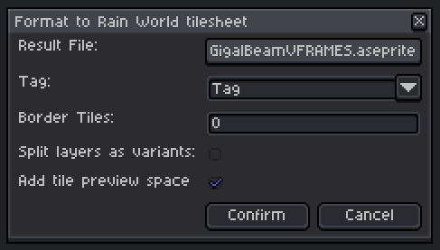

# Aseprite-RW-Tile-Exporter
An aseprite script for quickly and easily exporting a sprite with multiple frames into a custom tile graphic.

Created to lessen the tedium of creating and testing custom tiles and props by automating the process of converting an aseprite 'animation' to the tilesheet format used by the level editor.

## How to install
1) Download the script by opening the file in this repository and pressing `CTRL+SHIFT+S`.
2) In Aseprite, navigate to `File -> Scripts` and press `Open Scripts Folder`.
3) Move the script from your downloads folder into the newly opened scripts folder.
4) Back in Aseprite, go to `File -> Scripts` again and press `Rescan Scripts Folder`.
5) You can now access the script by navigating to `File -> Scripts -> rw-tile-exporter`.
   
## How to use
### Format
The sprite must be in a certain format to work best with the exporter.
- When making a tile, the width and height should be divisible by 20 (the size of a single 'cell' of a tile).
- The background should be transparent.
- Each frame of the sprite's animation should correspond to a sublayer of the tile, with earlier frames being further forward.
- A sprite's layers can optionally be exported as tile variants (such as for varied props or tiles that use #rnd). Hidden layers will be ignored.
### Exporting
Running the script through Aseprite should bring up an interface that looks like this:

#### Result File:
This is the file that the tile will be exported as. This cannot be the same as the source file, as to not accidentally overwrite it.
#### Tag:
This will only appear if the sprite has any tags set. This allows you to select the tag whose frames will be exported, useful for having multiple similar tiles within a single sprite file.
#### Border Tiles:
This is the number of border/buffer tiles the tile has, and is only used by the script to determine the size of the tile preview space.
#### Split layers as variants:
Allows you to choose whether the sprite's layers should be exported as different tile variants, or should be stacked into a single variant.
#### Add tile preview space:
Allows you to choose whether a space will be added for the tile's preview. Disable this if you are making something without a preview, such as a prop.

## Additional
- [Custom Tile Guide](https://github.com/Rain-World-Modding/Rain-World-Modding.github.io/blob/main/pages/region-development/level-editor/Custom-Palettes%2C-Tiles-and-Props.md)
- [Tile Init Editor](https://drive.google.com/file/d/15it9oLIAD5698Y-4xe6cmD_ckdAHs-As/view) by Bro (download link)
- [Aseprite Animation Docs](https://www.aseprite.org/docs/animation/) (useful as the exporter heavily uses animation related features)